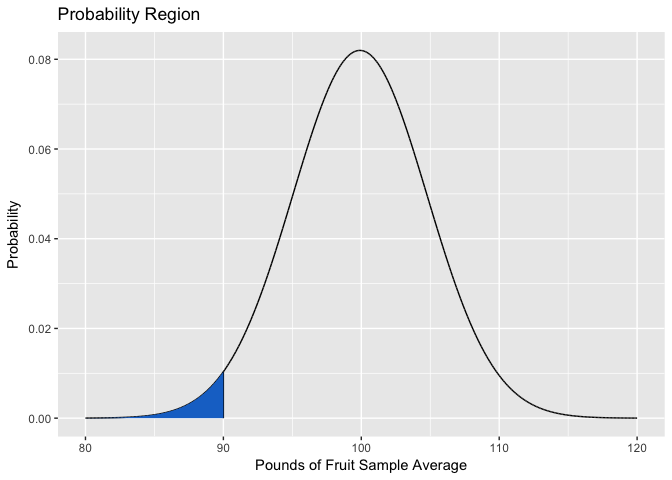
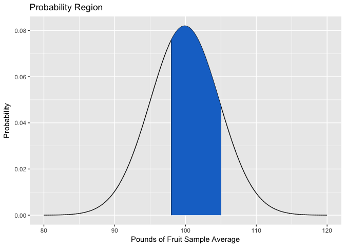
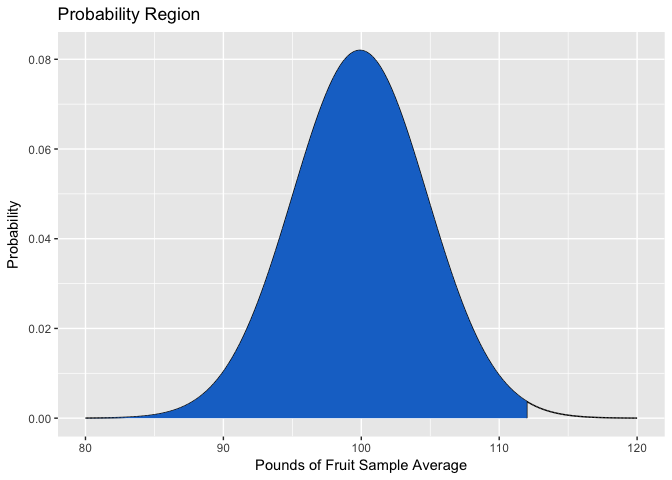
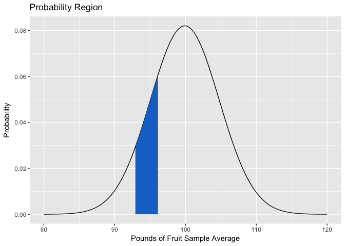

Week 4 Practice
================
Alan Kessler

This problem is from Chapter 7: Sampling and Sampling Distributions, Section 7.2: Sampling Distribution of Sample Means [(Black, 2016, p. 222)](#ref).

> 7.18
> The Statistical Abstract of the United States published by the U.S. Census Bureau reports that the average annual consumption of fresh fruit per person is 99.9 pounds. The standard deviation of fresh fruit consumption is about 30 pounds. Suppose a researcher took a random sample of 38 people and had them keep a record of the fresh fruit they ate for one year.
>
> 1.  What is the probability that the sample average would be less than 90 pounds?
>
> 2.  What is the probability that the sample average would be between 98 and 105 pounds?
>
> 3.  What is the probability that the sample average would be less than 112 pounds?
>
> 4.  What is the probability that the sample average would be between 93 and 96 pounds?
>
The following package is used in this problem:

``` r
library(ggplot2)

# Adjust my output to avoid scientific notation
options(scipen=999)
```

Part A
------

"What is the probability that the sample average would be less than 90 pounds?" suggests that I need to find $P(\\bar{x}&lt;90)$ which requires the following inputs:

-   $\\mu\_{\\bar{x}}=\\mu=99.9$
-   $\\sigma\_{\\bar{x}}=\\frac{\\sigma}{\\sqrt{n}}=\\frac{30}{\\sqrt{38}}$

I need to find the area of the following shaded region.

``` r
# Create x-space for plotting
x <- seq(80, 120, 0.001)   
# Apply pdf to each value in the x-space
df<-data.frame(x=x, y=dnorm(x, 99.9, 30/sqrt(38)))
# Create the boundary for the shaded region
region <- rbind(c(80, 0), subset(df, x<90), c(90, 0))

qplot(x=df$x, y=df$y, geom="line") +
  geom_segment(aes(x=90, y=0, xend=90, yend=dnorm(90, 99.9, 30/sqrt(38)))) +
  geom_polygon(data=region, aes(x, y), fill="dodgerblue3") +
  ggtitle("Probability Region") +
  xlab("Pounds of Fruit Sample Average") +
  ylab("Probability")
```



This would be found using:

``` r
pnorm(90, 99.9, 30/sqrt(38))
```

The result is a probability that the sample average would be less than 90 pounds of **0.021**.

Part B
------

"What is the probability that the sample average would be between 98 and 105 pounds?" suggests that I need to find $P(98&lt;\\bar{x}&lt;105)$ which requires the same inputs as part a.

I need to find the area of the following shaded region.

``` r
# Create the boundary for the shaded region
region <- rbind(c(98, 0), subset(df, x>98 & x<105), c(105, 0))

qplot(x=df$x, y=df$y, geom="line") +
  geom_segment(aes(x=98, y=0, xend=98, yend=dnorm(98, 99.9, 30/sqrt(38)))) +
  geom_segment(aes(x=105, y=0, xend=105, yend=dnorm(105, 99.9, 30/sqrt(38)))) +
  geom_polygon(data=region, aes(x, y), fill="dodgerblue3") +
  ggtitle("Probability Region") +
  xlab("Pounds of Fruit Sample Average") +
  ylab("Probability")
```



This would be found using:

``` r
pnorm(105, 99.9, 30/sqrt(38)) - pnorm(98, 99.9, 30/sqrt(38))
```

The result is a probability that the sample average would be between 98 and 105 pounds of **0.5046**.

Part C
------

"What is the probability that the sample average would be less than 112 pounds?" suggests that I need to find $P(\\bar{x}&lt;112)$ which requires the the same inputs as part a.

I need to find the area of the following shaded region.

``` r
# Create the boundary for the shaded region
region <- rbind(c(80, 0), subset(df, x<112), c(112, 0))

qplot(x=df$x, y=df$y, geom="line") +
  geom_segment(aes(x=112, y=0, xend=112, yend=dnorm(112, 99.9, 30/sqrt(38)))) +
  geom_polygon(data=region, aes(x, y), fill="dodgerblue3") +
  ggtitle("Probability Region") +
  xlab("Pounds of Fruit Sample Average") +
  ylab("Probability")
```



This would be found using:

``` r
pnorm(112, 99.9, 30/sqrt(38))
```

The result is a probability that the sample average would be less than 112 pounds of **0.9935**.

Part D
------

"What is the probability that the sample average would be between 93 and 96 pounds?" suggests that I need to find $P(93&lt;\\bar{x}&lt;96)$ which requires the same inputs as part a.

I need to find the area of the following shaded region.

``` r
# Create the boundary for the shaded region
region <- rbind(c(93, 0), subset(df, x>93 & x<96), c(96, 0))

qplot(x=df$x, y=df$y, geom="line") +
  geom_segment(aes(x=93, y=0, xend=93, yend=dnorm(93, 99.9, 30/sqrt(38)))) +
  geom_segment(aes(x=96, y=0, xend=96, yend=dnorm(96, 99.9, 30/sqrt(38)))) +
  geom_polygon(data=region, aes(x, y), fill="dodgerblue3") +
  ggtitle("Probability Region") +
  xlab("Pounds of Fruit Sample Average") +
  ylab("Probability")
```



This would be found using:

``` r
pnorm(96, 99.9, 30/sqrt(38)) - pnorm(93, 99.9, 30/sqrt(38))
```

The result is a probability that the sample average would be between 93 and 96 pounds of **0.1333**.

References
----------

Black, K. (2016). *Business statistics : for contemporary decision making*. Hoboken: Wiley.
